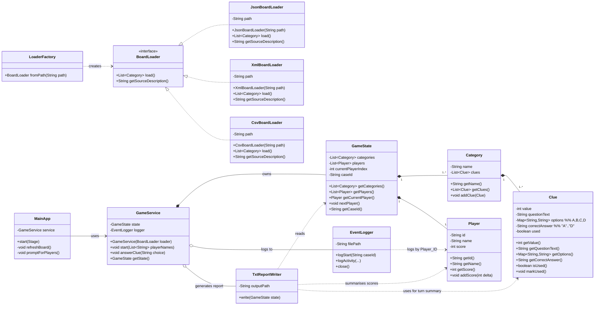

```mermaid
classDiagram
    direction LR

    class MainApp {
        +start(Stage)
        -GameService service
        -void refreshBoard()
        -void promptForPlayers()
    }

    class GameService {
        -GameState state
        -EventLogger logger
        +GameService(BoardLoader loader)
        +void start(List~String~ playerNames)
        +void answerClue(String choice)
        +GameState getState()
    }

    class GameState {
        -List~Category~ categories
        -List~Player~ players
        -int currentPlayerIndex
        -String caseId
        +List~Category~ getCategories()
        +List~Player~ getPlayers()
        +Player getCurrentPlayer()
        +void nextPlayer()
        +String getCaseId()
    }

    class Category {
        -String name
        -List~Clue~ clues
        +String getName()
        +List~Clue~ getClues()
        +void addClue(Clue)
    }

    class Clue {
        -int value
        -String questionText
        -Map~String,String~ options  %% A,B,C,D
        -String correctAnswer        %% "A".."D"
        -boolean used
        +int getValue()
        +String getQuestionText()
        +Map~String,String~ getOptions()
        +String getCorrectAnswer()
        +boolean isUsed()
        +void markUsed()
    }

    class Player {
        -String id
        -String name
        -int score
        +String getId()
        +String getName()
        +int getScore()
        +void addScore(int delta)
    }

    class BoardLoader {
        <<interface>>
        +List~Category~ load()
        +String getSourceDescription()
    }

    class JsonBoardLoader {
        -String path
        +JsonBoardLoader(String path)
        +List~Category~ load()
        +String getSourceDescription()
    }

    class XmlBoardLoader {
        -String path
        +XmlBoardLoader(String path)
        +List~Category~ load()
        +String getSourceDescription()
    }

    class CsvBoardLoader {
        -String path
        +CsvBoardLoader(String path)
        +List~Category~ load()
        +String getSourceDescription()
    }

    class LoaderFactory {
        +BoardLoader fromPath(String path)
    }

    class EventLogger {
        -String filePath
        +logStart(String caseId)
        +logActivity(...)
        +close()
    }

    class TxtReportWriter {
        -String outputPath
        +write(GameState state)
    }


    %% Relationships

    MainApp --> GameService : uses
    GameService *-- GameState : owns
    GameService o-- EventLogger : logs to
    GameService o-- TxtReportWriter : generates report

    GameState "1" *-- "1..*" Category
    GameState "1" *-- "1..4" Player

    Category "1" *-- "1..*" Clue

    BoardLoader <|.. JsonBoardLoader
    BoardLoader <|.. XmlBoardLoader
    BoardLoader <|.. CsvBoardLoader

    LoaderFactory ..> BoardLoader : creates

    EventLogger ..> Player : logs by Player_ID
    TxtReportWriter ..> GameState : reads
    TxtReportWriter ..> Player : summarises scores
    TxtReportWriter ..> Clue : uses for turn summary
```
